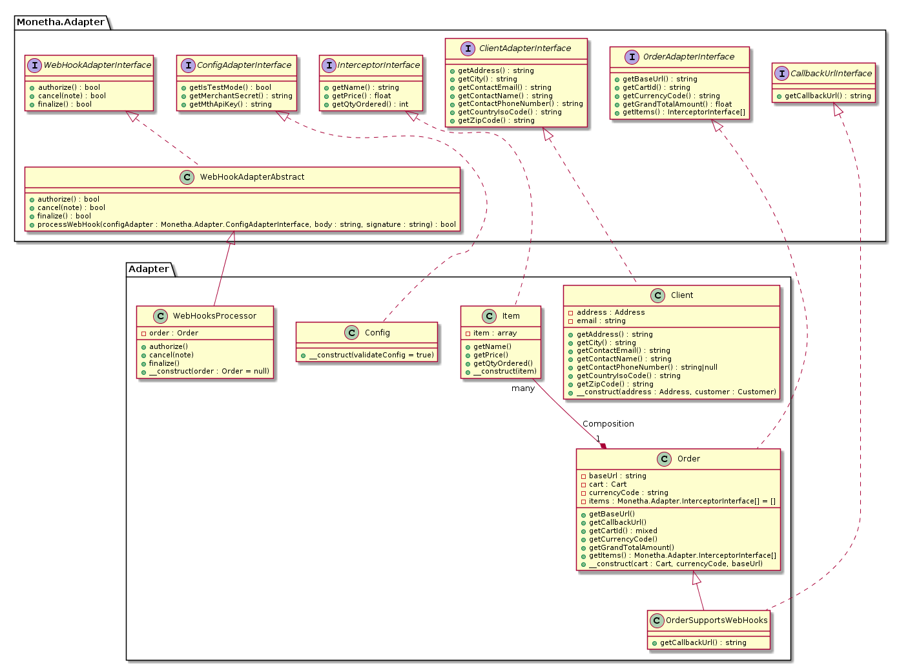
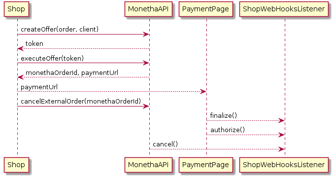

# Monetha's payment gateway integration SDK

Use the Monetha plugin to start accepting payments in your e-commerce store.

## Installation

```shell
composer config repositories.monetha/payment-plugin-php-sdk vcs https://gitlab.com/monetha/payment-plugin-php-sdk.git
```

```shell
composer require monetha/payment-plugin-php-sdk
```

## Documentation

In order to start integration you have to just implement 4 interfaces:

1. `Monetha/Adapter/ConfigAdapterInterface.php` - to retrieve/validate API key etc.
2. `Monetha/Adapter/ClientAdapterInterface.php` returns buyer information
3. `Monetha/Adapter/OrderAdapterInterface.php` provides order information
4. `Monetha/Adapter/InterceptorInterface.php` is a single item from the order. 

### Class diagram



### Sequence diagram



## Simple example

#### Creating an order

```php
// Full example is inside `/index.php`.

$apiKey = 'Please register in order to acquire'; // https://www.monetha.io/e-commerce
$merchantSecret = 'MONETHA_SANDBOX_SECRET'; // being provided with an API key above
$testMode = true; // if true all payments will be executed on Ropsten testnet

// by using Monetha\ConfigAdapterTrait jnside Config class
// and setting those private variables from arguments,
// you\'re actually implementing Monetha\Adapter\ConfigAdapterInterface
// which is required to construct Monetha\Services\GatewayService below
$config = new Config(
    $merchantSecret,
    $apiKey,
    $testMode
);

$gateway = new Monetha\Services\GatewayService($config);

try {
    // optional and could be called only when updating Monetha's API settings
    $gateway->validateApiKey();

    // create an offer (before actual payment step)
    $createOfferResponse = $gateway->createOffer($order, $client);
    $token = $createOfferResponse->getToken();

    // when pressing "Pay now"
    $executeOfferResponse = $gateway->executeOffer($token);

    // getting payment page redirect URL
    $paymentUrl = $executeOfferResponse->getPaymentUrl();

    // the rest information about deal
    $monethaOrder = $executeOfferResponse->getOrder();

} catch(Monetha\Response\Exception\ApiException $e) {
    error_log(
        'Status code: ' . $e->getApiStatusCode() .
        ', error: ' . $e->getApiErrorCode() .
        ', message: ' . $e->getMessage()
    );

    echo $e->getFriendlyMessage();

    return;
}

// redirect
header('Location: ' . $paymentUrl);
```

#### Canceling an order
```php
// if then you want to cancel the order for some reason
try {
    $monethaOrderId = $executeOfferResponse->getOrderId();
    $jsonResponse = $gateway->cancelExternalOrder($monethaOrderId)->getResponseJson();
//   $jsonResponse->order_status->name == 'OrderCanceled'

    // do the rest actions on shop side

} catch(ApiException $e) {
    error_log(
        'Status code: ' . $e->getApiStatusCode() .
        ', error: ' . $e->getApiErrorCode() .
        ', message: ' . $e->getMessage()
    );

    echo 'Cannot cancel the order. ' . $e->getFriendlyMessage();

    return;
}

echo 'Order cancelled.';
```
#### Webhooks

Monetha's Payment Gateway supports webhooks during such events on it's side like

* order.canceled
* order.finalized
* order.money_authorized

In order to support Webhooks' receiving you have to

1. Extend `Monetha\Adapter\WebHookAdapterAbstract` class by implementing 3 appropriate abstract methods:
* `cancel()` - what to do in case if order was canceled through mth-api call
* `finalize()` - ...order was paid on the payment page where used was redirected
* `authorize()` - ...order was paid by card (authorization was successful)

2. Your class that implements `Monetha/Adapter/OrderAdapterInterface.php` needs to implement`Monetha\Adapter\CallbackUrlInterface` as well (it's only method should return the endpoint URL where Monetha will send JSON data in case of the events above).

3. Process incoming request in the way below:
```php
$bodyString = file_get_contents('php://input');
$signature = !empty($_SERVER['HTTP_MTH_SIGNATURE']) ? $_SERVER['HTTP_MTH_SIGNATURE'] : '';
try {
    // signature will be checked to ensure that sender is authorized
    // processWebHook() is base a class method which encapsulates calls
    // to your finalize(), authorize() and cancel() implementations,
    // (depends on the event)
    $result = $this->processWebHook($this->config, $bodyString, $signature);
} catch(ValidationException $e) {
    // in case of signature is invalid or event is unsupported
    error_log($e->getMessage());
    $result = false;
}

if ($result) {
    echo 'OK'; // or just send 'No Content' status code like http_response_code(204);
} else {
    // Send appropriate code to Monetha in case of any error occurred on e-shop side
    http_response_code(500);
}
```

Consider full example at `index.php` file.

## Security

## Contribution

## Changelog
